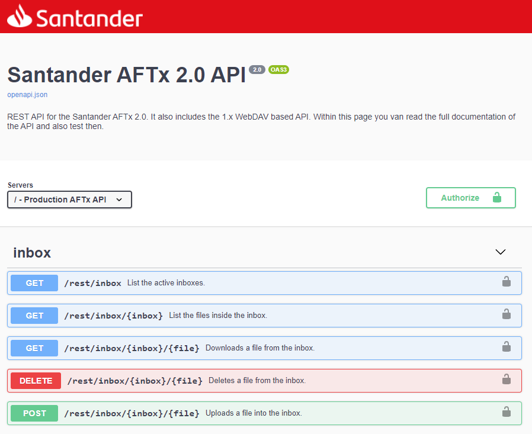

# Interface Webdav do AFTx
Copyright (c) 2007-2019 Open Commnications Security

* Autores:
  * Fabio Jun Takada Chino
  * Cesar Luiz Ferracin
  * Rafael Teixeira
  * Augusto Kiramoto

## Sobre este documento

Este documento descreve a interface de aplicação disponibilizada pelo **AFTx** para
outras aplicações. Este documento é especialmente importante para integrações que não
utilizam a linguagem **Java**.

Para usuários do **Java**, recomenda-se o uso da biblioteca de integração
**AFTxWebDAVClient** que encontra-se neste repositório em:

* /java/AFTxWebDAVClient

### Nota importante sobre esta versão

Este cliente funciona nas versões 1.x do **AFTx** e na versão 2.x do **AFTx** no
modo de compatibilidade. Para novas integrações com o **AFTx** 2.x, é recomendado
o uso da nova interface REST implementada por esta versão pois, além de mais completa,
é mais fácil de utilizar por ferramentas que possuem integração direta *Web Services*
REST, especialmente se a ferramenta escolhida possuir suporte para o 
[OpenAPI](https://swagger.io/specification/) versão 3.0.3.

### Audiência

Este documento destina-se a desenvolvedores de aplicação que possuem conhecimentos
sobre o desenvolvimento de aplicações Web e o uso dos protocolos HTTP, HTTPS e
WEBDAV.

## Comunicação com outros sistemas

A comunicação do **AFTx** com outros sistemas se dá por uma interface **WebDAV** 
([RFC4918](https://tools.ietf.org/html/rfc4918)). Neste caos, os arquivos são
listas, baixados e/ou enviados utilizando este padrão.

É importante salientar que esta interface precede a adoção em larga escala
dos WebServices **REST** e por isto não deve ser confundida com a interpretação
moderna desta.

Embora bastante similar aos WebServices REST, esta interface **WebDAV** possui
algunas pequenas diferenças de operação que as torna incompatíveis em algunas
situações.

É importante salientar que o AFTx normalmente expõe o protocolo HTTPS usando
um certificado SSL auto-assinado. Nestes casos, é necessário permitir que o
cliente possa a cessar o **AFTx** aceitando o certificado utilizado.

## Endereço padrão do AFTx

Por padrão, o **AFTx** expõe uma conexão HTTPS na porta 8443 usando todos os IPs 
disponíveis no computador no qual o **AFTx** está instalado.

Para acessar o serviço é necessário utilizar um usuário e uma senha definida dentro
da interface de configuração do **AFT**/**AFTx**.

Com exceção das operações de subida de arquivo e remoção de arquivos, todas as
demais podem ser simuladas por qualquer navegador de Internet.

## Autenticação

Todas as chamadas ao **AFTx** devem ser autenticadas com um usuário e senha definidos
dentro do **AFTx**. A autenticação é sempre feita utilizando o padrão 
**Basic access authentication** definido pelo padrão HTTTP na 
[RFC7617](https://tools.ietf.org/html/rfc7617).

## Direitos dos usuários para cada operações

Determinadas operações só são permididas para os usuários somente se
as seguintes combinações de direitos estiverem configuradas no **AFTx**:

Operação | deleteEnabled | getEnabled | logEnabled | putEnabled
-------- | ------------- | ---------- | ---------- | ----------
Listar arquivos da caixa de entrada | - | sim | - | -
Baixar arquivos da caixa de entrada | - | sim | - | -
Apagar arquivos da caixa de entrada | sim | sim | - | -
Subir arquivo na caixa de saída | - | - | - | sim
Listar logs | - | - | sim | -
Baixar logs | - | - | sim | -

## Operações disponívies

Por medidas de segurança, o **AFTx** expõe apenas interfaces para:

* Listar, baixar e apagar arquivos da caixa de entrada;
* Enviar arquivos para a caixa de saída;
* Listar e baixar arquivos de log do AFTx;

A listagem de arquivos da caixa de saída bem com a listagem das caixas
disponíveis não podem ser executas por este interface.

Todas as operações seguem o protocolo WebDAV e não devem ser confundidas
com operações REST.

### Listar arquivos da caixa de entrada

A listagem de arquivos da caixa de entrada se dá pela chamada da URL com o verbo **GET**:

* https://\<baseUrl>:\<port>/list/\<inboxName>

onde:

* \<baseUrl>: IP ou nome do servidor;
* \<port>: Porta do AFTx;
* \<inboxName>: Nome da caixa de entrada;

O código de retorno será 200/OK e o conteúdo da resposta será um XML simples no formato:

```
<availableFiles>
    <file>file1</file>
    <file>file2</file>
    <file>file3</file>
    ...
    <file>filen</file>
</availableFiles>

```

#### CURL

```
$ curl https://<baseUrl>:<port>/list/<inboxName>
```

### Baixar arquivos da caixa de entrada

A listagem de arquivos da caixa de entrada se dá pela chamada da URL com o verbo **GET**:

* https://\<baseUrl>:\<port>/get/\<inboxName>/\<filename>

onde:

* \<baseUrl>: IP ou nome do servidor;
* \<port>: Porta do AFTx;
* \<inboxName>: Nome da caixa de entrada;
* \<filename>: Nome do arquivo a ser baixado;

O código de retorno será 200/OK e o conteúdo da resposta será o conteúdo do arquivo.

#### CURL

```
$ curl https://<baseUrl>:<port>/get/<inboxName>/<filename>
```

### Apagar arquivo da caixa de entrada

A listagem de arquivos da caixa de entrada se dá pela chamada da URL com o verbo **DELETE**:

* https://\<baseUrl>:\<port>/delete/\<inboxName>/\<filename>

onde:

* \<baseUrl>: IP ou nome do servidor;
* \<port>: Porta do AFTx;
* \<inboxName>: Nome da caixa de entrada;
* \<filename>: Nome do arquivo a ser apagado;

O código de retorno será 204/No Content. Esta chamada não retorna nenhum conteúdo.

É importante notar que os arquivos da caixa de entrada precisam ser apagados pela
aplicação. O **AFTx** não apaga os arquivos automaticamente.

#### CURL

```
$ curl -X DELETE https://<baseUrl>:<port>/delete/<inboxName>/<filename>
```

### Enviar arquivo da caixa de saída

A listagem de arquivos da caixa de entrada se dá pela chamada da URL com o verbo **PUT**:

* https://\<baseUrl>:\<port>/put/\<outboxName>/\<filename>

onde:

* \<baseUrl>: IP ou nome do servidor;
* \<port>: Porta do AFTx;
* \<outboxName>: Nome da caixa de saída;
* \<filename>: Nome do arquivo a ser enviado;

Neste caso o conteúdo do corpo da requisição é o conteúdo do arquivo a ser enviado.

O código de retorno será 201/Created. Esta chamada não retorna nenhum conteúdo.

#### CURL

```
$ curl -t <file-to-upload> https://<baseUrl>:<port>/put/<inboxName>/<filename>
```

### Listar arquivos da caixa de logs

A listagem de arquivos da caixa de entrada se dá pela chamada da URL com o verbo **GET**:

* https://\<baseUrl>:\<port>/logs

onde:

* \<baseUrl>: IP ou nome do servidor;
* \<port>: Porta do AFTx;

O código de retorno será 200/OK e o conteúdo da resposta será um XML simples no formato:

```
<?xml version="1.0" encoding="UTF-8"?>
<ul>
  <li>
    <a href="/log/log-name1.xml">log-name1.xml</a>
    <a href="/log/log-name2.xml">log-name2.xml</a>
    <a href="/log/log-name3.xml">log-name3.xml</a>
  </li>
</ul>
```

#### CURL

```
$ curl https://<baseUrl>:<port>/logs
```

### Baixar arquivos da caixa de logs

A listagem de arquivos da caixa de entrada se dá pela chamada da URL com o verbo **GET**:

* https://\<baseUrl>:\<port>/log/\<logname>

onde:

* \<baseUrl>: IP ou nome do servidor;
* \<port>: Porta do AFTx;
* \<logname>: Nome do arquivo de log;

O código de retorno será 200/OK e o conteúdo da resposta será o conteúdo do arquivo de log.

#### CURL

```
$ curl https://<baseUrl>:<port>/log/<logname>
```

## Exemplo de implementação

Um exemplo da implementação desta API é a **AFTxWebDAVClient** que encontra-se neste 
repositório no diretório:

* /java/AFTxWebDAVClient

## Notas sobre a versão 2.x

A partir da versão 2.1.2 do AFTx, a documentação da API de integração estará disponível
por meio do **SwaggerUI** na própria aplicação na **URL** padrão da aplicação:

```
https://<baseUrl>:<port>/
```



Esta página do **SwaggerUI**  também trás uma descrição mais detalhada das
**APIs** da versão 1.x, reproduzindo o conteúdo deste texto.
